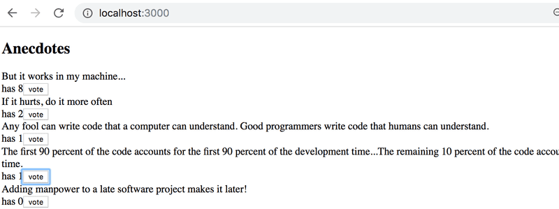

# Anecdotes -redux application

# redux application look

## Code Implemented and things have been leanred from this project

1. ✅ voting function with redux.
2. ✅ add new anecdotes with redux.
3. ✅ sort with ordered by the number of votes.
4. ✅ action creator function
5. ✅ separate component with react and redux
